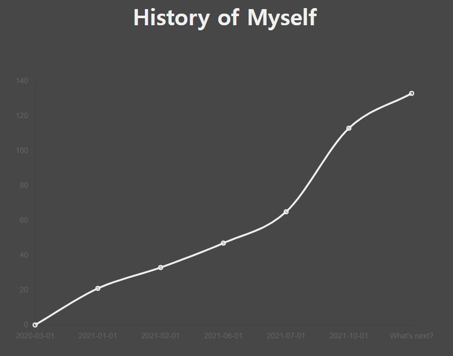
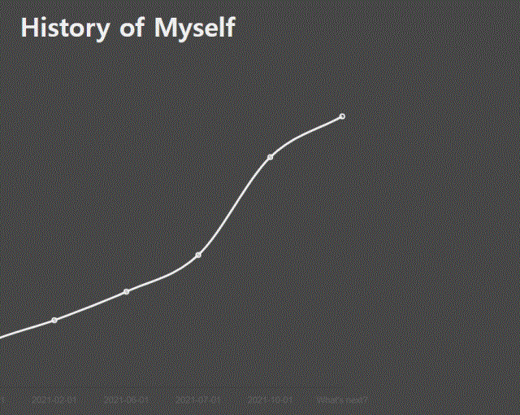

# Portfolio

다음 링크로 접속해 홈페이지를 바로 확인할 수 있습니다.

[http://www.coline.tk:8080/src/index.html](http://www.coline.tk:8080/src/index.html)

---

## 💻 기술 스택

- **Front**: Vanila Javascript
- **Back**: Java + Spring Boot

---

## ✅ 요구 사항

- [x] 데이터베이스 사용
- [x] Rest API 사용
- [x] Chart.js 사용
- [x] Open libraries 사용을 최소화

---

## 👓 GUI 사용법

Chart.js 를 활용해 저를 나타낼 수 있는 방법을 고민하다가, 다음과 같이 개발자를 준비해온 저의 지난 날을 그래프로 나타내보았습니다.  
 가로축은 시간을, 세로축은 개발자로써 성장한 저의 위치(실력)를 나타냅니다.

 

마우스를 chart의 point에 가져다대면 위와 같이 원이 커지면서 사용자의 마우스 움직임에 반응합니다.

 

마우스를 chart의 포인트에 가져다 댄 후 클릭을 하면 상세내용을 팝업 형태로 확인할 수 있으며 toggle 형식으로 상세내용을 켜고 끌 수 있습니다.

    
   
   
   
마지막 entry는 저의 미래를 표현했습니다. "What's next?"를 클릭해 미래가 기대되는 저의 모습을 확인할 수 있습니다.
